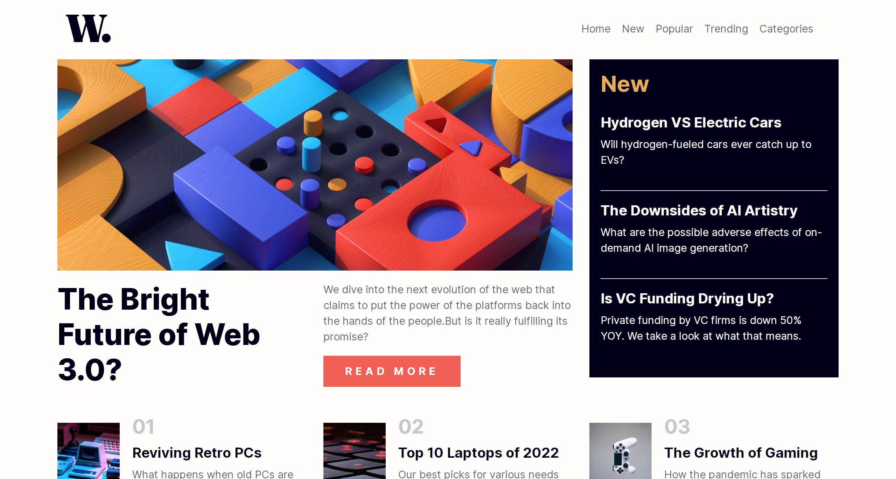
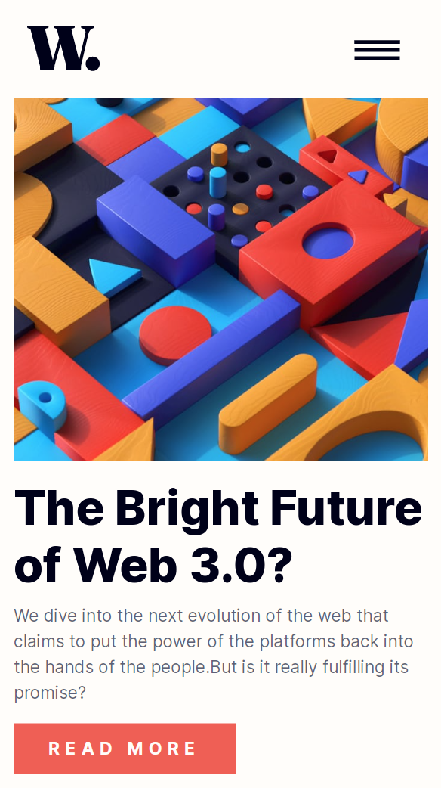

# Frontend Mentor - News homepage solution

This is a solution to the [News homepage challenge on Frontend Mentor](https://www.frontendmentor.io/challenges/news-homepage-H6SWTa1MFl).

## Table of contents

- [Overview](#overview)
  - [Screenshot](#screenshot)
  - [Links](#links)
- [My process](#my-process)
  - [Built with](#built-with)
  - [What I learned](#what-i-learned)
- [Author](#author)

## Overview

### Screenshot

Desktop 💻  

Mobile 📱  

### Links

- Live Site URL: [Click me !](https://beckyyyyy.github.io/bootstrap-newsHomepage/)

## My process

### Built with

- Build with Bootstrap

## Author

- [Website](https://beckyyyyy.github.io/portfolio/)
- [Gmail](nkes50723@gmail.com)
